# Proyecto Blacklist-service

## Entrega 2 - Integración Continua

## 1. Integrantes: *Grupo 12*

- Oscar Saraza
- Keneth Bravo
- Juan Camiño Peña
- David Gutierrez

**Link Video Presentación Entrega 2:** [pendiente]

**Repositorio GitHub:** https://github.com/KenethBravoP/blacklist_service (rama `master`)

---

## 2. Descripción de la solución

Sobre la base del microservicio desplegado en la Entrega 1, el equipo construyó un pipeline de integración continua que se dispara automáticamente cada vez que se empuja un commit a la rama `master`. El pipeline descarga el código del repositorio, instala las dependencias, ejecuta las pruebas unitarias y, si todo pasa en verde, genera el artefacto de despliegue en formato `.zip` y lo publica en un bucket de S3. Si alguna prueba falla, el pipeline se detiene y no se genera artefacto, evitando así que código roto llegue al proceso de despliegue.

La orquestación se implementó con **AWS CodePipeline** usando dos etapas: una etapa `Source` que se conecta al repositorio de GitHub mediante una conexión **CodeStar**, y una etapa `Build` que invoca un proyecto de **AWS CodeBuild** con el `buildspec.yml` del repositorio. Toda la infraestructura — bucket S3 para artefactos, roles IAM, proyecto CodeBuild, conexión CodeStar y el propio CodePipeline — está declarada en Terraform (`terraform/codebuild.tf`) para que cualquier integrante del equipo pueda reproducirla ejecutando `terraform apply`.

Para las pruebas unitarias se optó por usar **SQLite en memoria** en lugar de aprovisionar un motor de base de datos dentro del proceso de CI. Esta decisión se tomó porque el microservicio usa SQLAlchemy como capa de abstracción sobre la base de datos, por lo que las pruebas verifican correctamente la lógica de negocio y la integración con el ORM sin necesidad de levantar un Postgres real dentro de CodeBuild, reduciendo el tiempo de ejecución del pipeline y simplificando su configuración.

---

## 3. Pruebas unitarias sobre los endpoints

Los escenarios de prueba se encuentran en `tests/test_blacklists.py` y usan las fixtures definidas en `tests/conftest.py`. Cada una de las tres rutas HTTP expuestas por el microservicio tiene al menos un caso de prueba asociado:

- **`GET /health`** — se valida que responde `200 OK` con el payload `{"status": "ok"}`, confirmando que la aplicación quedó inicializada correctamente.
- **`POST /blacklists`** — se cubren tres escenarios: creación exitosa de un nuevo registro en la lista negra (201), rechazo de registros duplicados (409) y validación de payload inválido cuando el email, el UUID o el motivo no cumplen las reglas (400).
- **`GET /blacklists/<email>`** — se validan dos caminos: cuando el email está en la lista negra la respuesta es `200 OK` con `is_blacklisted=true` y el motivo asociado; cuando no lo está, la respuesta es también `200 OK` pero con `is_blacklisted=false` y `blocked_reason=null`.

Adicionalmente se incluyó una prueba transversal que verifica que los endpoints protegidos rechazan las solicitudes sin el token `Bearer`, devolviendo `401 Unauthorized`. En total son siete escenarios que corren en pocos segundos y se ejecutan tanto localmente (con `poetry run pytest`) como dentro del pipeline de CodeBuild.

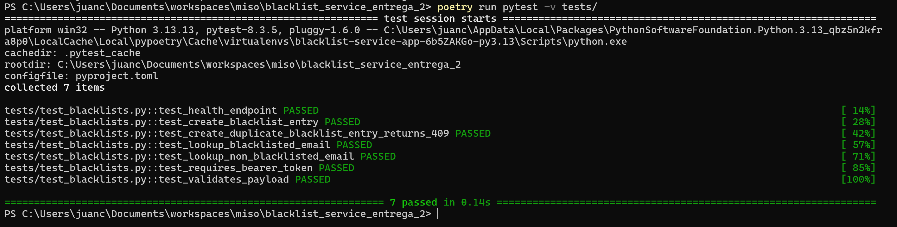

---

## 4. Pipeline de integración continua

### 4.1 Archivos de configuración en el repositorio

El comportamiento del build está declarado en el archivo `buildspec.yml` ubicado en la raíz del repositorio:

```yaml
version: 0.2

phases:
  install:
    runtime-versions:
      python: 3.11
    commands:
      - python -m pip install --upgrade pip
      - pip install poetry
      - poetry config virtualenvs.create false
      - poetry install --no-interaction --no-ansi
  pre_build:
    commands:
      - poetry run pytest -v tests/
  build:
    commands:
      - zip -r blacklist-service.zip . -x "tests/*" "terraform/*" "docs/*" ".git/*" ".github/*" "__pycache__/*" "*/__pycache__/*" "*.pyc" ".venv/*" "venv/*" ".pytest_cache/*" "*.db" "*.sqlite3"

artifacts:
  files:
    - blacklist-service.zip
  discard-paths: yes
  name: blacklist-service-$(date +%Y%m%d-%H%M%S)
```

El manejo de dependencias dentro del CI se realiza con **Poetry**, que es la herramienta que el proyecto ya usa localmente (`pyproject.toml` + `poetry.lock`). Al delegarle la instalación de paquetes a Poetry, el entorno del CI queda alineado con el del desarrollador y se garantiza que las versiones instaladas sean exactamente las mismas gracias al lock file. El `requirements.txt` del repositorio se mantiene porque la plataforma Python de Elastic Beanstalk lo utiliza al momento del despliegue.

### 4.2 Infraestructura del pipeline

Toda la infraestructura del CI se definió en `terraform/codebuild.tf`. Los recursos aprovisionados son:

- **Bucket S3 `blacklist-service-dev-ci-artifacts-*`** donde el pipeline deja tanto el código fuente descargado de GitHub como el artefacto `.zip` generado al final del build.
- **Proyecto CodeBuild `blacklist-service-dev-ci`** configurado con el compute type más pequeño (`BUILD_GENERAL1_SMALL`) sobre la imagen `aws/codebuild/standard:7.0`. Como el proyecto se invoca desde CodePipeline, su fuente y sus artefactos son de tipo `CODEPIPELINE`.
- **Conexión CodeStar con GitHub**, que es el canal que usa CodePipeline para detectar cambios en el repositorio.
- **CodePipeline `blacklist-service-dev-pipeline`** con dos etapas: `Source` (CodeStar/GitHub, rama `master`, con `DetectChanges=true`) y `Build` (invoca al proyecto CodeBuild).
- **Roles IAM** con las políticas mínimas necesarias: el rol de CodeBuild tiene permisos de CloudWatch Logs y acceso al bucket de artefactos; el rol de CodePipeline tiene permisos para usar la conexión CodeStar, disparar builds y leer/escribir en el bucket.

### 4.3 Disparo automático sobre master

La etapa `Source` del pipeline incluye `BranchName = "master"` y `DetectChanges = true`. Con estos dos parámetros, CodePipeline registra internamente un webhook contra la conexión CodeStar y recibe notificaciones de GitHub cada vez que se empuja un commit a esa rama. Cuando llega la notificación, el pipeline arranca automáticamente desde la etapa `Source`, sin que sea necesario activarlo manualmente desde la consola de AWS. Commits a otras ramas o pull requests no disparan el pipeline.

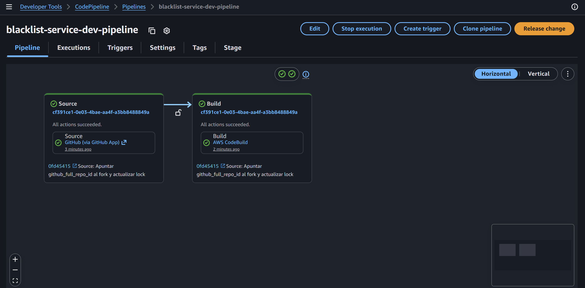

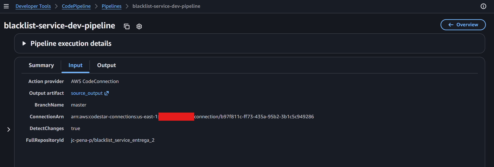

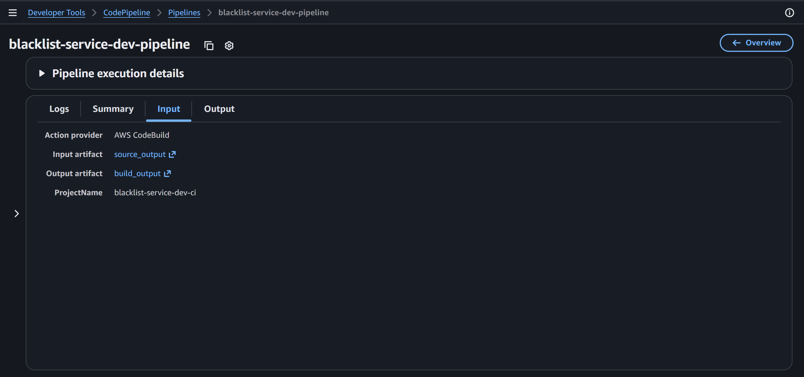

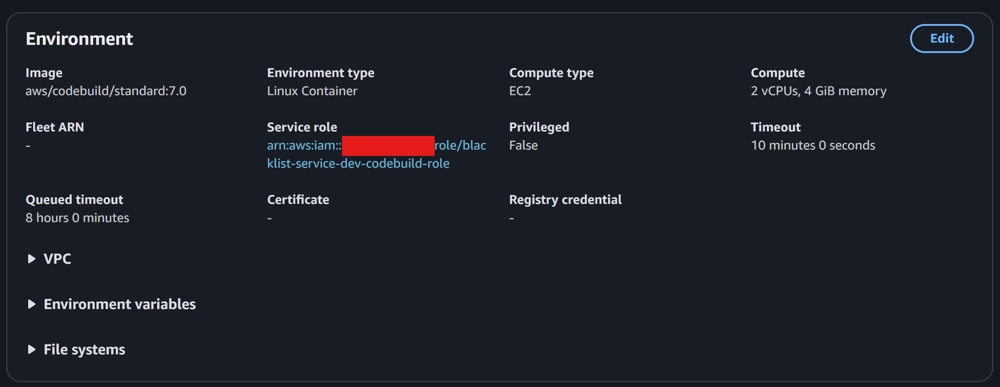

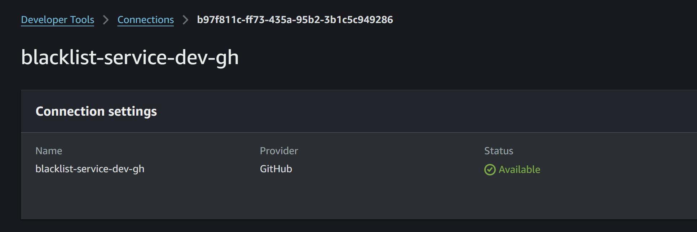

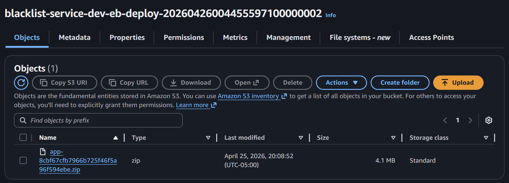

---

## 5. Ejecuciones del pipeline

### 5.1 Ejecución exitosa

La primera ejecución que se documenta corresponde a un commit ordinario sobre la rama configurada que no altera la lógica de los endpoints. Al realizar el push, CodePipeline detectó el cambio en menos de un minuto y disparó la ejecución.

La etapa `Source` descargó el código y lo entregó como artefacto a la etapa `Build`. CodeBuild instaló Poetry y las dependencias, ejecutó las siete pruebas de `pytest` — todas en verde — y generó el `.zip` con el código de la aplicación, que quedó publicado en el bucket S3 de artefactos.

Algunas observaciones a partir de esta ejecución:

- El pipeline completo tomó aproximadamente _[rellenar]_ minutos, siendo la fase de instalación de dependencias la más larga (aproximadamente _[rellenar]_ segundos).
- CodeBuild parte desde una instalación limpia en cada ejecución, por lo que los tiempos son estables entre ejecuciones sucesivas. Si en entregas posteriores se buscara reducir este tiempo, se podría habilitar el cache de CodeBuild para el directorio de Poetry.
- El artefacto generado pesa alrededor de _[rellenar]_ KB, gracias a que las carpetas `tests/`, `terraform/` y `docs/` se excluyen en el paso de empaquetado.
- La separación entre el bucket S3 de CI (`ci_artifacts`) y el bucket de despliegue de Beanstalk (`eb_app_bucket`) deja clara la frontera entre el proceso de CI y cualquier proceso de CD que se agregue en entregas posteriores, en línea con la indicación de esta entrega de no implementar despliegue automatizado.

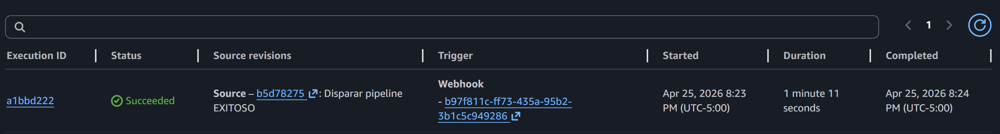

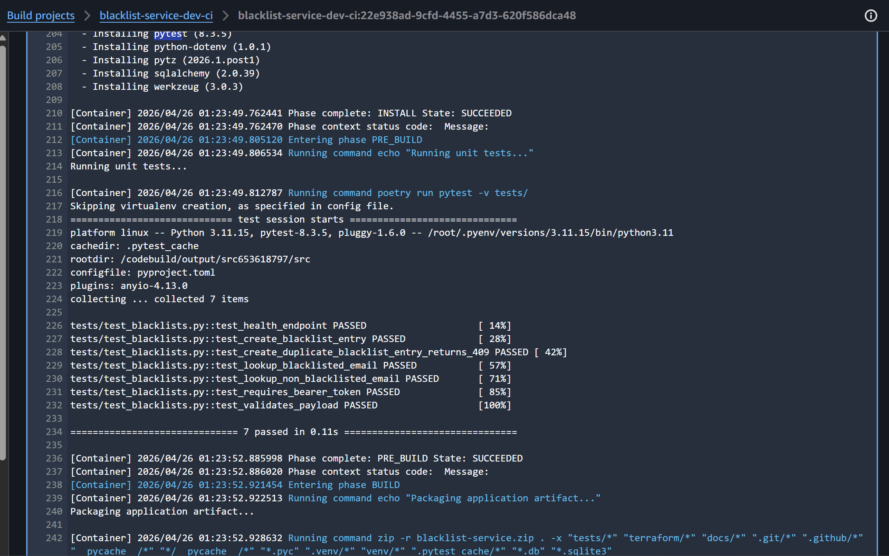

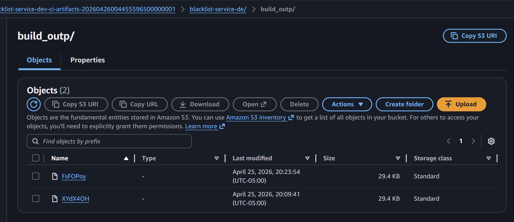

### 5.2 Ejecución fallida

Para evidenciar el comportamiento del pipeline ante un cambio que rompe las pruebas, se agregó temporalmente un test forzadamente inválido en `tests/test_blacklists.py`:

```python
def test_forzar_fallo_pipeline():
    assert False, "Prueba forzada para evidencia de pipeline fallido"
```

Al empujar este commit, CodePipeline disparó el pipeline como de costumbre. La etapa `Source` se completó con éxito al descargar el código, pero la etapa `Build` terminó en rojo durante la fase `PRE_BUILD` porque `pytest` devolvió código de salida distinto de cero al encontrar el test que falla.

Algunas observaciones a partir de esta ejecución:

- Al fallar la fase de pruebas, CodeBuild marcó el build como `FAILED` y CodePipeline detuvo el pipeline sin llegar a ejecutar la fase `BUILD` (empaquetado) ni la fase `UPLOAD_ARTIFACTS` (publicación a S3).
- En consecuencia **no se generó artefacto nuevo** ni se actualizó el bucket de CI, que es exactamente el comportamiento esperado de un pipeline de integración continua: romper temprano y no publicar código que no pasa las pruebas.
- Los logs de CloudWatch muestran con claridad el test que falló y su mensaje, facilitando el diagnóstico por parte del desarrollador.
- Inmediatamente después de documentar el fallo se revirtió el commit problemático con `git revert`, lo que disparó una nueva ejecución que terminó en verde.

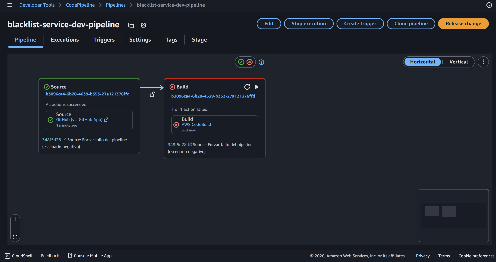

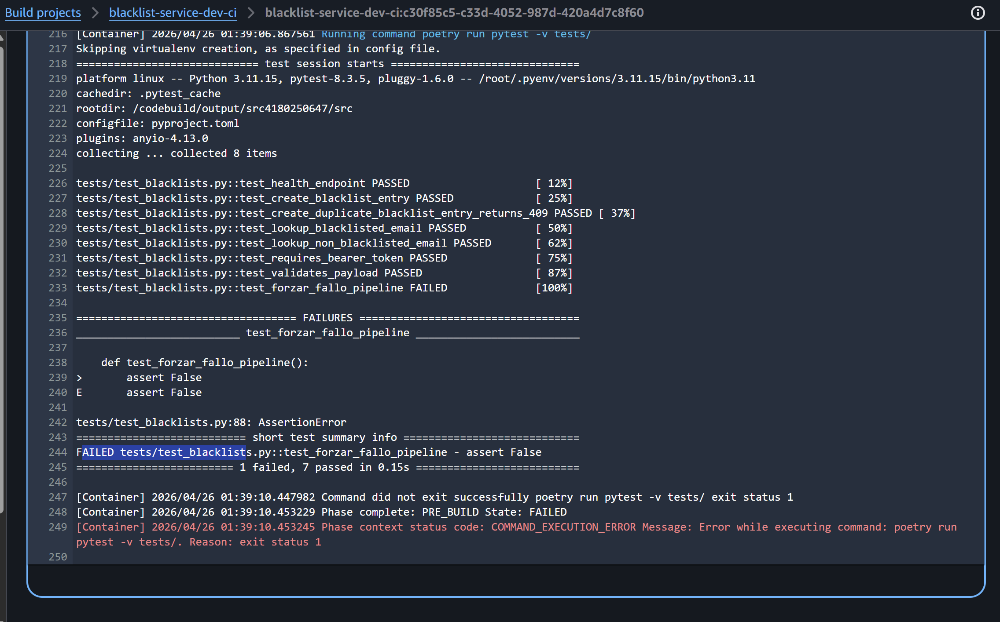

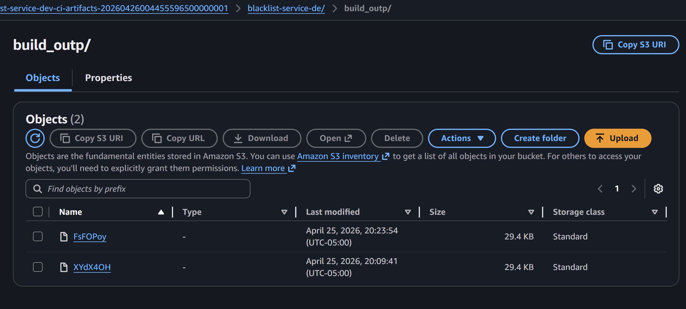

---

## 6. Conclusiones

El uso combinado de **CodePipeline** y **CodeBuild** resultó natural y permite separar claramente las dos responsabilidades del CI: detectar cambios en el repositorio (Source) y ejecutar el proceso de build propiamente dicho (Build). Tener CodePipeline como orquestador deja además la puerta abierta a agregar etapas posteriores de despliegue automatizado cuando el proyecto avance a la fase de CD, sin tener que rehacer la infraestructura.

La decisión de delegar la gestión de dependencias a **Poetry** fue acertada porque alinea el entorno de CI con el entorno local de los desarrolladores y aprovecha el `poetry.lock` que ya existía en el repositorio desde la Entrega 1. Las pruebas con **SQLite en memoria** resultaron suficientes para validar la lógica de los endpoints, y mantener el CI sin motor de base de datos redujo significativamente el tiempo de ejecución del pipeline.

El único paso de la infraestructura que no se pudo automatizar completamente con Terraform fue la **autorización inicial de la conexión CodeStar con GitHub**: AWS la crea en estado `Pending` y requiere que un humano con acceso al repositorio la apruebe desde la consola una única vez. Este paso se documentó en el README del repositorio para que cualquier integrante del equipo pueda replicarlo.
